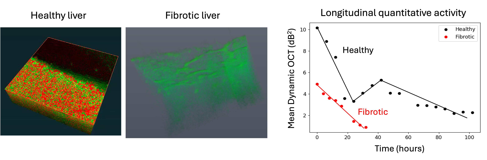
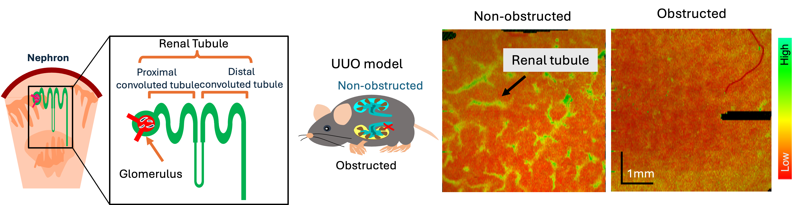

Our group is interested in developing next-generation medical devices and computational tools to assess complex biological processes within intricate biological systems non-invasively and label-free. Through advanced engineering, we aim to achieve deeper tissue penetration, faster acquisition times, multi-functional contrasts, and automated high-throughput visualization of biological systems.

Our current research interests are the following: 
* [**Label-free imaging**](#Label-free imaging)
* [**Multi-functional optical coherence tomography**](#Multi-functional optical coherence tomography)
- [**Quantitative polarization microscopy**](#Quantitative polarization microscopy)
- [**Computational imaging**](#Computational imaging) 

### Label-free imaging
Label-free imaging captures the intrinsic properties of a sample, such as the sample’s refractive index variations, autofluorescence, molecular vibrations, birefringence, scattering or absorption properties, to generate imaging contrast without the use of fluorescent dyes or contrast agents. This preserves the natural state of biological samples, making it suitable for long-term studies and clinical use. 

We recently introduced a label-free approach for three-dimensional visualization of cellular and tissue metabolic activity without the need for labeling agents. By employing a customized scanning protocol and statistically analyzing rapid-time-sequence optical coherence tomography (OCT) signals at the same location of a sample, we are able to visualize and quantify tissue metabolism. This method was used to study the long-term activity of healthy and fibrotic liver microvasculature, revealing high dynamics in the liver's periportal/pericentral region and degradation of tissue activity over time. 
{: .center-image }
Another study demonstrated the usefullness of a label-free technique to visualize the activity of renal tubules in normal and unilateral obstructed kidney models.
{: .center-image }

### Multi-functional optical coherence tomography 
Optical coherence tomography (OCT) is a non-invasive imaging technique that provides high-resolution (micrometer), cross-sectional views of biological tissue. Multi-functional OCT expands the capabilities of conventional OCT by providing both structural and functional aspects of tissues, enabling more detailed assessments of various medical conditions. 

An example of multi-functional OCT is the Jones matrix-based polarization-sensitive OCT (JM-OCT). By proper signal processing algorithms, JM-OCT can provide multi-functional information about tissue properties, such as its structural properties (OCT intensity), dynamic properties (tissue activity), angiography (blood flow information), and polarization properties (birefringence).

### Quantitative polarization microscopy 
Polarization microscopy has been used for a long time to study the structural anisotropy and molecular orientation in birefringent tissues like muscle fibers, collagen, nerve tissues, and other fibrous tissues. Recent advancements in computational methods and imaging technologies have expanded the capabilities of polarization microscopy into quantitative polarization microscopy (QPM). Techniques such as Mueller matrix microscopy provide a complete description of the polarization properties of specimens, including birefringence, optical rotation, and depolarization. Analyzing the full Mueller matrix can enhance contrast and differentiate between different tissue types that are otherwise inaccessible with conventional microscopy techniques.

### Computational imaging 

Computational imaging leverages advanced computational techniques to enhance the performance of traditional imaging technologies, overcoming their inherent limitations, and allowing for richer contrast extraction.   In the realm of functional OCT, computational algorithms are used to analyze temporal changes in the data. This enables the mapping of physiological processes such as tissue activity and blood flow, providing valuable insights into the functional aspects of biological systems. Moreover, computational methods like principal component analysis can be employed to synthesize multi-contrast data. This synthesis helps extract meaningful information about different tissue types based on their optical properties, offering a deeper understanding of the biological structures being studied. Computational imaging thus represents a powerful tool in advancing both the capabilities and applications of imaging technologies in biomedical research.
