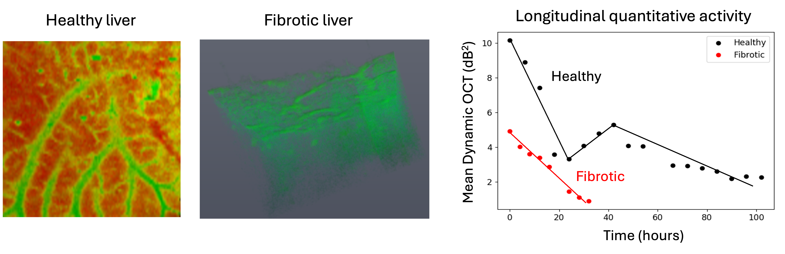

Our group is interested in developing next-generation medical devices and computational tools to assess complex biological processes within intricate biological systems non-invasively and label-free. Through advanced engineering, we aim to achieve deeper tissue penetration, faster acquisition times, multi-functional contrasts, and automated high-throughput visualization of biological systems.

Our current research interests are the following: 
* [**Label-free imaging**](#Label-free imaging)
* [**Multi-functional optical coherence tomography**](#Multi-functional optical coherence tomography)
- [**Quantitative polarization microscopy**](#Quantitative polarization microscopy)
- [**Computational imaging**](#Computational imaging) 

### Label-free imaging
Label-free imaging captures intrinsic properties of a sample, such as sample’s refractive index variations, autofluorescence, molecular vibrations, metabolism, birefringence, scattering or absorption properties, to generate imaging contrast without the use of contrast agents. This preserves the natural state of biological samples, making it suitable for long-term studies and clinical use.

We recently introduced a label-free approach for three-dimensional visualization of cellular and tissue metabolic activity without the need for fluorescent dyes [[El sadek et al., Biomedical Optics Express, 11, 6231-6248 (2020)](https://www.osapublishing.org/boe/abstract.cfm?uri=boe-11-11-6231) and [El Sadek et al., Biomedical Optics Express, 12, 6844-6863 (2021)](https://www.osapublishing.org/boe/abstract.cfm?uri=boe-12-11-6844)]. By employing a customized scanning protocol and statistically analyzing rapid-time-sequence optical coherence tomography (OCT) signals at the same location of a sample, we were able to visualize and quantify tissue metabolism. This method was used to study the long-term activity of healthy and fibrotic liver microvasculature complex (See below figure) [[Mukherjee et al., Scientific Reports 11, 20054 (2021)](https://www.nature.com/articles/s41598-021-98909-6)]
{: .center-image }
and the activity of renal tubules in normal and unilateral obstructed kidney models (See below figure) [[Mukherjee et al., Scientific Reports 13, 15324 (2023)](https://www.nature.com/articles/s41598-023-42559-3)].
{: .center-image }

### Multi-functional optical coherence tomography 
Optical coherence tomography (OCT) is a cross-sectional imaging technique that provides micrometer-order resolution and three-dimensional views of a sample. Multi-functional OCT expands the capabilities of conventional OCT by providing both structural and functional aspects of biological tissues.

An example of multi-functional OCT is the Jones matrix-based polarization-sensitive OCT (PS-OCT) [[Yoshiaki Yasuno, IEEE J. Sel. Top. Quantum Electron. 29, 6800918 (2023)](https://ieeexplore.ieee.org/document/10050559)]. By proper signal processing algorithms, JM-OCT can provide multi-functional information about tissue properties, such as its structural properties (OCT intensity), dynamic properties (tissue activity), angiography (blood flow information), and polarization properties (birefringence, degree of polarization uniformity). An illustration of multi-functional imaging for different stages of non-alcoholic fatty liver disease liver models is shown below [[Mukherjee et al., Biomedical Optics Express, 13, 4071-4086 (2022)](https://opg.optica.org/boe/abstract.cfm?uri=boe-13-7-4071)].

### Quantitative polarization microscopy (QPM) 
Polarization microscopy has long been instrumental in studying the structural anisotropy and orientation of birefringent tissues such as muscle fibers, collagen, nerve tissues, and other fibrous materials. Recent advancements in computational techniques and imaging technologies have significantly enhanced its capabilities, leading to the development of quantitative polarization microscopy (QPM). 
Techniques like Mueller matrix microscopy now offer a comprehensive and quantitative analysis of a specimen's polarization properties, including birefringence, optical rotation, diattenuation, and depolarization—parameters that are beyond the reach of conventional microscopy methods.
[[Mukherjee et al., Biomedical Optics Express, 10(8), 3847-3859 (2019)](https://www.osapublishing.org/abstract.cfm?URI=boe-10-8-3847)].

### Computational imaging 

Computational imaging utilizes advanced computational algorithms to enhance the capabilities of traditional imaging systems, overcoming their inherent limitations and allowing for richer contrast extraction. Some examples of computational imaging methods applied in optical coherence tomography include computational adaptive optics, deep learning, speckle reduction techniques, and others. Computational techniques like principal component analysis can be used to synthesize multi-contrast optical coherence tomography data (including structural OCT, birefringence, attenuation coefficient, and tissue motility) [[Mukherjee et al., Scientific Reports 11, 20054 (2021)](https://www.nature.com/articles/s41598-021-98909-6)]. This allows for extracting or enhancing meaningful details to highlight different tissue structures in a single fused image based on their optical properties.
